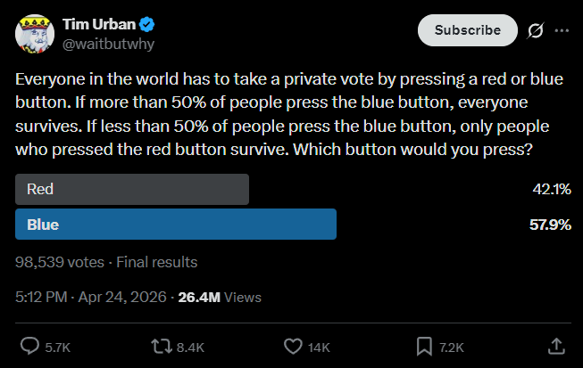
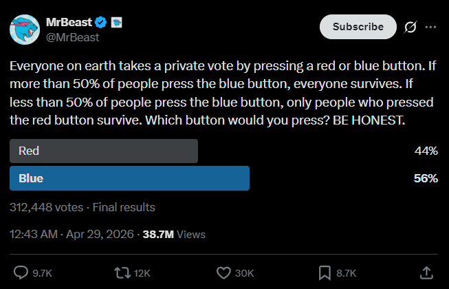
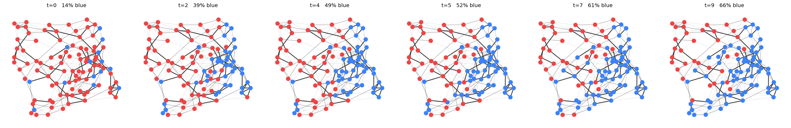
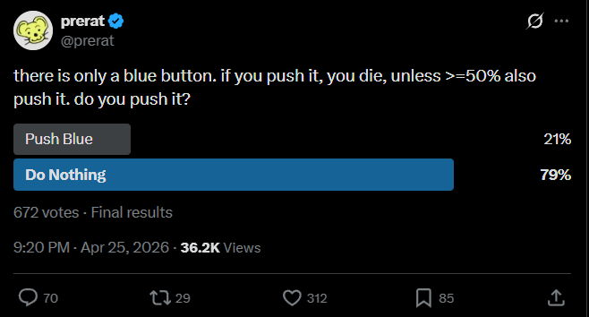
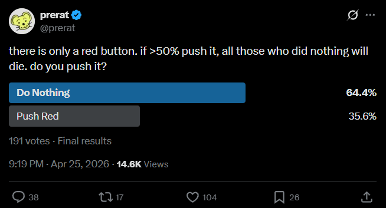

# Red button / blue button

In April 2026, the red-button-blue-button hypothetical went viral (again):


The hypothetical is relatively simple: Everybody takes a private vote, where they press a Red Button or a Blue Button. If you press the red button, you are guaranteed to survive. However, if you press the blue button - you will survive only if >=50% of people also pressed the blue button.

The kneejerk reaction from many people is: obviously, press red, so you survive!
But interestingly, the results show the opposite:





This suggests some interesting dynamics at play. The words 'prosocial' and 'altruistic' are brought up a lot, but I don't think this is entirely correct.

I believe it is usually in a person's best interest to press the blue button because the cost of pressing the red button is not limited to you: remember, *everybody* takes a *private vote*. This includes your mother; your children; your spouse: how certain are you that none of them would press blue? It therefore becomes in your self-interest to press blue.

In this repo we model this dynamic. The simulation looks like this:



Further intesting models:

prerat has some interesting polls, whereby two separate polls are created.

https://x.com/prerat/status/2048135020301164923 > 
https://x.com/prerat/status/2048134933105811803 > 

There is a clear bias towards 'Do nothing' despite having opposite effects. 
This suggests that the action of pushing the button is a sort of friction; doing nothing is a natural thing. When the actions are equal - pressing one button or the other - is when we get an unbiased view.

https://x.com/prerat/status/2049409225692971457 > Is 58% a law of nature? 


## The model

People are nodes in a [Watts-Strogatz](https://en.wikipedia.org/wiki/Watts%E2%80%93Strogatz_model) social graph. Each round, person *i* presses blue if the **rescue pressure** they feel — the (weighted) sum of neighbors who'll press blue — exceeds their **rescue threshold**:

```
press blue   if   Σ_{j ∈ neighbors} weight(i,j) · pressed_blue(j)   >   rescue_threshold(i)
```

Intuition: *"if my loved ones might press blue, they'll die unless 50% of the world also presses blue — so I have to press blue too, to give them a chance."* Once blue, always blue.

A `stubborn_red` fraction never engages with this reasoning and stays red regardless.

## Variants

| | `main.py` | `main_weighted.py` |
|---|---|---|
| Edge weights | uniform | family `1.0` / friend `0.5` / acquaintance `0.25` |
| Stubborn red | none | yes (default 15%) |
| `initial_blue` | 0.15 | 0.15 |
| `rescue_threshold` | 1.5 | 1.0 |
| Result (single seed) | 15% → 100% in 4 steps | 14% → 66% in 9 steps |

The unweighted model is a baseline — with any non-trivial seed, blue cascades to total takeover. The weighted model with stubborn red lands near the empirical Twitter result.

## Run

```sh
uv run python main.py
uv run python main_weighted.py
```

Outputs PNG snapshots and (for the weighted run) a timeline plot.

## Files

- `simulation.py` — model: `build`, `build_weighted`, `run`. The update step is a single sparse matrix-vector product.
- `main.py`, `main_weighted.py` — runnable demos with visualization.
